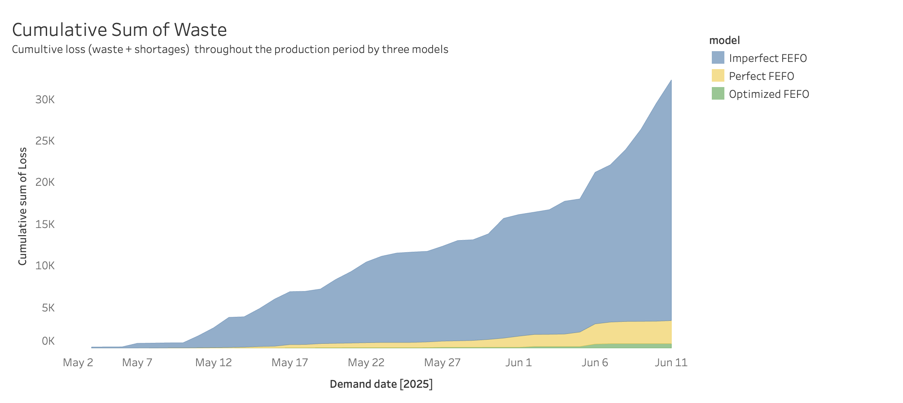
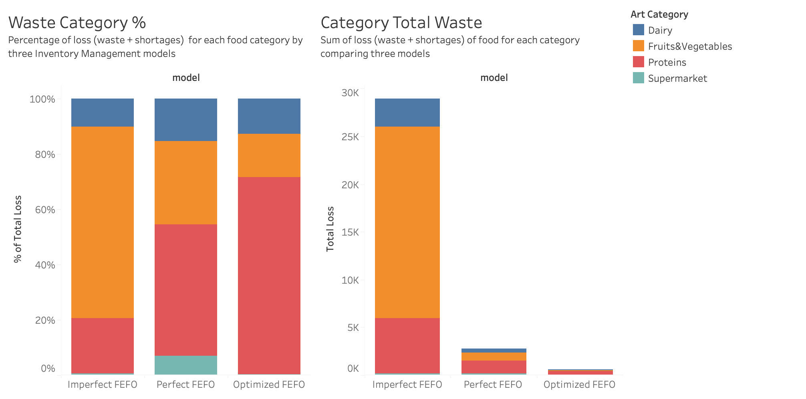

# Modeling Inventory Operations and Demand Allocation in a Meal Kit Business

## Executive Summary

In growing startups dealing with perishable goods, operational precision is not a nice-to-have—it’s a necessity. This project tells the story of a fictional meal kit business navigating the real-world challenge of scaling its operations while maintaining efficiency. Through simulation and optimization, we evaluate the cost of minor process deviations and explore the potential for smarter models that not only cut waste but also create new opportunities for impact and customer engagement.

Three **allocation models**—imperfect FEFO, perfect FEFO, and optimization-based—are compared to reveal the operational and strategic **consequences** of inventory behavior. The results demonstrate that even small inefficiencies in stock handling (like a 3% deviation from FEFO) compound into significant production losses and organizational stress. More than a technical modeling exercise, this is a strategic narrative about how data and operations intertwine to shape product quality, team workload, and business opportunity.

## Introduction

The project simulates end-to-end inventory operations for a meal kit company. Starting from scraped HelloFresh recipes publicly available, it builds a synthetic production and inventory pipeline with a focus on modeling how shelf life, expiration dates, and allocation rules affect waste and fulfillment.

The story centers on a critical insight: **imperfect adherence to FEFO is not just a technical glitch—it’s a strategic vulnerability**. The project models three approaches:

1. **Imperfect FEFO**: Reflecting current operations (3% non-adherence).
2. **Perfect FEFO**: A baseline scenario with full compliance.
3. **Optimized Allocation**: A strategic model unlocking unused inventory for extra production.

The final outcome is both technical and business-facing: quantifying hidden losses and proposing new product and marketing models based on excess capacity.

## Methods

### Data Flow

A reproducible pipeline was developed to simulate realistic data:

### 🧑‍🍳 Menu (Product) Development

1. **Recipe scraping**: Recipes are extracted from HelloFresh, including names, tags, and ingredients.
2. **Master data integration**: A manually curated article list maps real-world item codes, unit costs (optional), and shel file details.
3. **Recipe BOMs**: Ingredient lists are matched with articles using fuzzy matching (Levenshtein distance) to generate full Bills of Materials.
4. **Menu planning and demand generation**:
   - **Horizon**: 6 weeks (aligned the with menu sales window horizon in the industry).
   - **Daily volume**: 950–1050 kits/day (a balance between realistic volume and manageable dataset size).
   - **Tags as weights**: Recipes are not scored directly. Instead, tags (e.g., “Family Friendly”) influence category-level weightings, mimicking how real meal planning operates.

### 🍱 Inventory Creation

No real inventory is available. A synthetic one is built with these principles:

- **Demand-driven quantity**: Purchase amounts are based on aggregated demand, grouped by shelf life.
- **Shelf-life buckets**:
  - Short shelf: ordered daily
  - Medium shelf: ordered every 3 days
  - Long shelf: ordered weekly
- **Expiration dates**: Randomized within limits based on category
- **Palletization**: Inventory is broken into 1,000-unit chunks to simulate batch-based handling

These shelf life structures are central: perishable goods introduce risk into the supply chain. They shape purchase behavior, dictate inventory structure, and justify the need for FEFO logic.

### 📁 Database Structure

Data is stored in a local SQLite database. Key components:

- **Tables**: `recipes`, `articles`, `bom`, `demand`, `inventory`
- **Views**: `demand_summary` calculates total ingredient demand based on the BOM and recipe plans

### 📦 FEFO Allocation Models

The function `fefo_daily()` simulates valid non-expired inventory allocation to customer demand following the First-Expired-First-Out principle. Potential remaining inventory that expires is then marked as "waste". By using a defined error parameter one can programmatically model inventory mismanagement, introducing a certain amount of randomness in the FEFO inventory allocation logic.

- **Inputs**: Inventory, demand, and a randomness value `e`
- **Logic**:
  - For each article and day, inventory is sorted by expiration date
  - A percentage `e` of picks ignore strict FEFO
- **Outputs**:
  - Daily demand development
  - Daily inventory development
  - Daily waste list  

This models the operational inefficiencies caused by loose adherence to FEFO—emulating warehouse fatigue, human error, or tracking gaps.

### 🧩 Optimization Model

A Mixed-Integer Linear Programming (MILP) model is implemented using `PuLP` and `GLPK`.

- **Objective**: Maximize number of extra recipes produced from leftover inventory
- **Constraints**:
  - Inventory limits by batch and expiration
  - Ingredient requirements by recipe
  - Production cannot exceed 1200 kits/day (minus current demand)
- **Output**: A new “suggested demand” table with additional recipes producible from leftovers

This approach reframes excess inventory from **“waste”** to **“opportunity”**.

## Results
The Operational Impact of Inventory Discipline

This project tests how small deviations from the FEFO principle impact performance. Over a simulated 6-week horizon and 1,062,679 units of planned demand, three scenarios are compared:

1. **Perfect FEFO** (`e = 0`): Strict adherence to expiration-based allocation.  
2. **Imperfect FEFO** (`e = 0.03`): A small 3% deviation simulates operational noise.  
3. **Optimized Usage**: Builds on Perfect FEFO by allocating surplus ingredients to produce additional recipes and reduce waste.

### 👌 Summary of Results

| Scenario             | Waste Units | Shortages | Loss %     | Fulfilled Demand % |
|----------------------|-------------|-----------|------------|-------------|
| **Perfect FEFO**     |       2,699 |        70 |    **0.26%** |      99.99% |
| **Imperfect FEFO**   |      17,273 |    11,638 |    **2.72%** |      98.90% |
| **+ Optimization**   |         564 |        70 |    **0.06%** |     107.79% |

> **Waste** = expired unused inventory within the demand time window  **Loss %** = (Waste units + Shortages units) / Customer Demand  **Fulfilled Demand %** = Produced Demand / Customer Demand

🎯 A small operational deviation—just 3% of inventory picked out of expiration order—results in **17,000 additional waste units** and **11,000 unmet recipe requirements**, showing how seemingly minor inefficiencies scale into major losses.

🧩 The optimization model doesn’t just improve numbers—it highlights untapped value in leftover inventory, encouraging alternative business models (e.g., donating, discounting, or batch-selling surplus meals).

---

### Visual Breakdown

 

This area chart illustrates cumulative loss across the production window of 6 weeks. The imperfect FEFO model generates significantly higher waste, climbing above 30K units, while the perfect FEFO reduces this sharply. The optimal model introduces a novel assumption—producing more than the original demand to minimize waste—and demonstrates further improvement. This suggests that inefficiencies in daily operations can have compounding effects over time.

 

Two stacked bar charts compare loss composition across inventory categories:  - By percentage: Fresh goods are greately improving throughout the scenarios, confirming the hypothesis that best inventory management practices are especially efficient on perishable goods.  - By total units: The considerable drop in units loss between the imperfect and perfect FEFO allocation logic is a powerful sign that best inventory practices play a pivotal role in cost reduction strategies.

 

## Conclusion

What may seem like small inefficiencies—such as a 3% deviation from FEFO—can translate into massive production losses. In this project, the simulation shows how imperfect stock handling spirals into waste, shortages, and organizational stress.

But beyond cost, this affects product quality and customer perception. Overworked operations, budget stress, and reactive procurement take a toll on how the end product feels.

Optimization reveals a new story: **if we shift the model from “fulfill demand” to “maximize value of existing inventory,” we unlock new possibilities.** Extra kits can be marketed creatively, donated, or offered as special editions—turning waste into reach and impact.

This project is a call for operational maturity, not only for technical accuracy but for strategic depth.

## Appendix

- [x] ER diagram and data lineage
- [x] Full codebase with modular scripts
- [x] Output overview of the three models
- [x] Database with intermediate and final tables